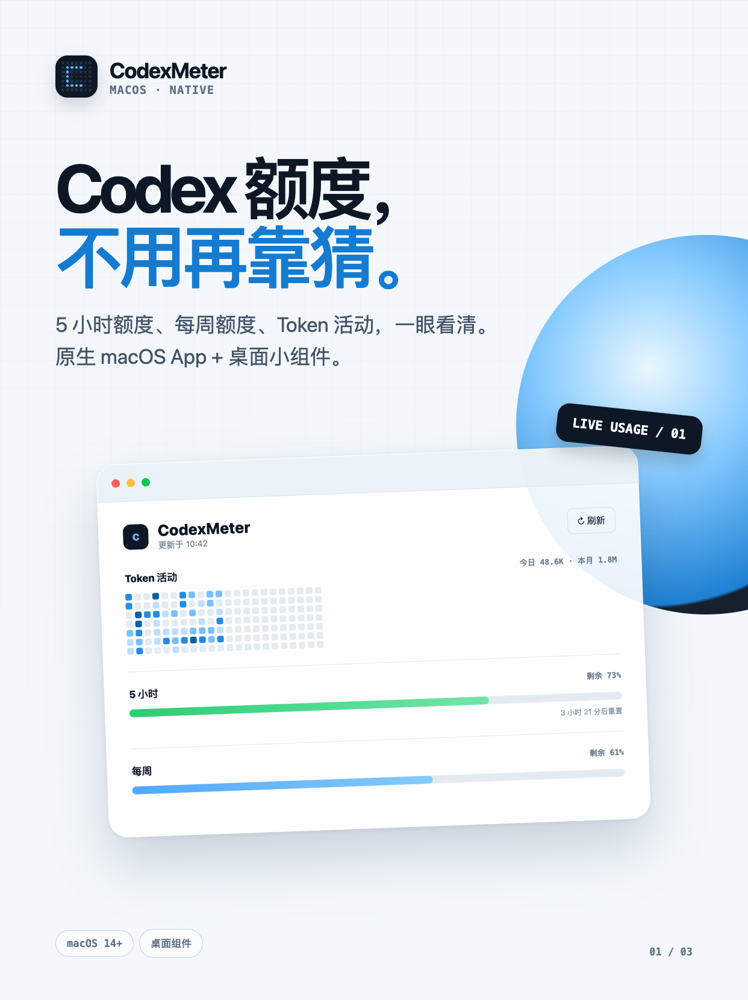
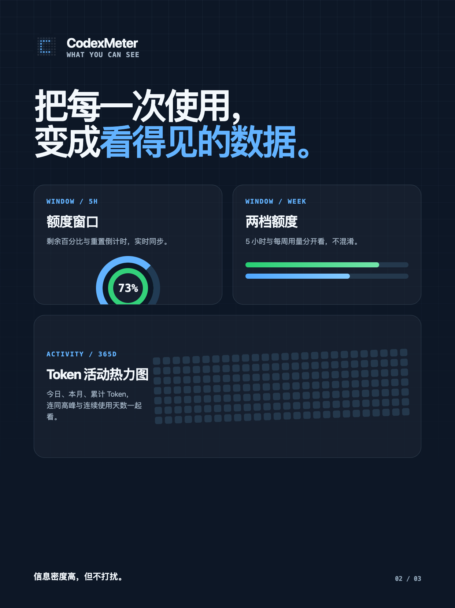
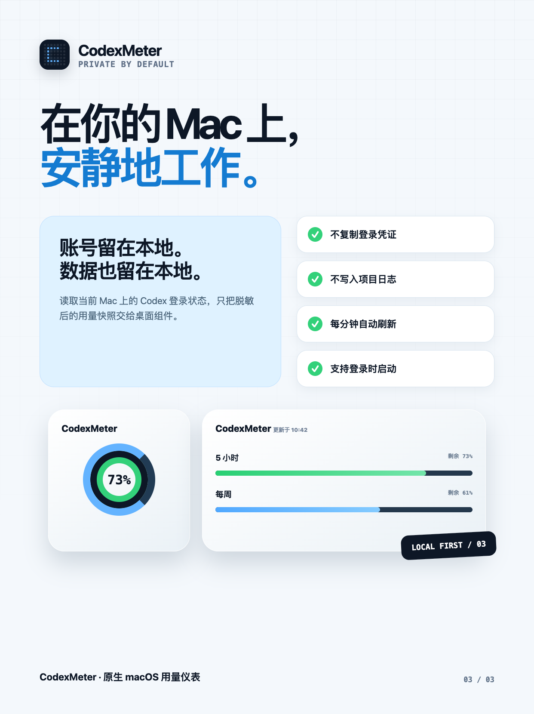

# CodexMeter

  

  原生 macOS Codex 用量仪表：把 5 小时额度、每周额度和 Token 活动放到桌面上。

  <a href="https://github.com/Eko-Wang/CodexMeter/releases/latest"><strong>下载最新版</strong></a>
  ·
  <a href="https://github.com/Eko-Wang/CodexMeter/releases/tag/v1.0.0">v1.0.0</a>

## 为什么做 CodexMeter

Codex 的额度信息不应该等到任务受限时才被想起。CodexMeter 把最常看的数据整理成一块安静、清晰的 macOS 仪表盘：打开 App 可以查看完整活动，在桌面小组件中则能随时确认剩余额度。

## 你能看到什么

- **两档额度**：分别显示 5 小时与每周剩余百分比。
- **准确的重置信息**：同时显示重置倒计时和具体时间。
- **Token 活动热力图**：以五档蓝色深浅呈现近一年的每日消耗。
- **活动概览**：今日、本月、累计 Token，以及峰值、最长任务和连续使用天数。
- **三种小组件**：小号用双环显示额度；中号聚焦两档用量；大号同时展示额度与热力图。
- **自动适配外观**：跟随 macOS 日间与夜间模式，使用接近系统组件的材质效果。
- **登录时启动**：后台自动刷新数据，点击桌面组件可直接打开 App。

  
  

## Local first

CodexMeter 读取当前 Mac 上已有的 Codex 登录状态和本地活动数据。登录凭证不会复制到 Widget、项目文件或日志；桌面组件只读取由主应用写入的脱敏用量快照。

## 安装

1. 前往 [Releases](https://github.com/Eko-Wang/CodexMeter/releases/latest) 下载 DMG。
2. 打开 DMG，将 `CodexMeter.app` 拖入“应用程序”。
3. 运行一次 CodexMeter。
4. 在桌面右键选择“编辑小组件”，搜索 `CodexMeter`，添加需要的尺寸。

> 当前公开构建使用本地签名，尚未经过 Apple Developer ID 公证。首次打开时 macOS 可能要求在 Finder 中右键应用并选择“打开”。

## 系统要求

- macOS 14 或更高版本
- 本机已登录 Codex / ChatGPT
- 使用官方 Token 活动统计时，需要本机安装 ChatGPT App

## 从源码构建

1. 使用 Xcode 15 或更高版本打开 `CodexMeter.xcodeproj`。
2. 选择 `CodexMeter` scheme 和当前 Mac。
3. Build & Run。

主应用每分钟刷新额度，并把脱敏快照同步给 Widget。登录项可在“系统设置 → 通用 → 登录项”中关闭。

## 宣传素材

`promo/xiaohongshu/` 包含三张竖版宣传图，以及用于复现图片的 HTML 与 Playwright 渲染脚本。
